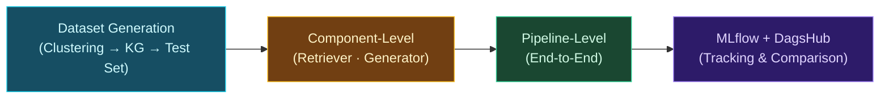
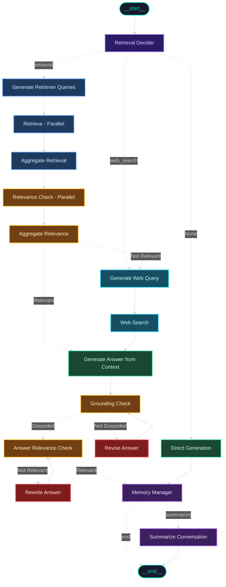
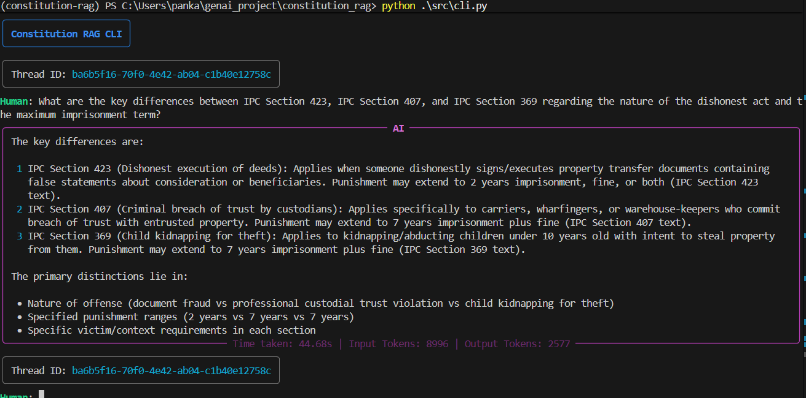
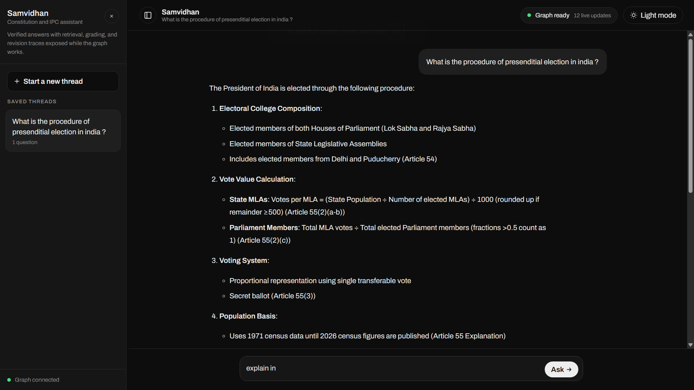

<p align="center">
  
  
  
  
  
  
  
  
  
</p>

<h1 align="center">Self-RAG & Corrective RAG for the Indian Constitution & IPC</h1>

<p align="center">
  <em>An agentic, self-correcting Retrieval-Augmented Generation system that delivers reliable, grounded answers on Indian law — powered by LangGraph, DeepSeek R1/V3, and multi-stage validation.</em>
</p>

---

## Overview

This project implements an advanced **Self-RAG** and **Corrective RAG (CRAG)** pipeline using **LangGraph** to provide question-answering over the **Constitution of India** and the **Indian Penal Code (IPC)**.

Unlike vanilla RAG, this system **self-evaluates and self-corrects** at every stage:

- **Routes intelligently** — decides between vector retrieval, web search, or direct generation per query.
- **Validates retrieved context** — filters irrelevant chunks via parallel Map-Reduce relevance scoring.
- **Checks grounding** — verifies the generated answer is supported by evidence.
- **Self-corrects** — rewrites or revises answers that fail grounding or relevance checks.
- **Falls back to web search** — automatically searches the web when local retrieval fails.
- **Maintains conversational memory** — rolling summarization preserves multi-turn context across sessions.

---

## Evaluation

A three-tier evaluation framework built with [DeepEval](https://docs.confident-ai.com/) measures the system at the **component**, **dataset generation**, and **full pipeline** level. All experiments are tracked with [MLflow](https://mlflow.org/) on [DagsHub](https://dagshub.com/), and the entire workflow is reproducible via [DVC](https://dvc.org/).

### Pipeline-Level Results

> End-to-end evaluation across the full LangGraph workflow with all self-correction loops active.

| Metric | Score |
|---|---|
| **Contextual Precision** | 0.96 |
| **Faithfulness** | 0.95 |
| **Answer Relevancy** | 0.94 |
| **Contextual Recall** | 0.93 |
| **Contextual Relevancy** | 0.76 |*

*\*Note on Contextual Relevancy: This score is lower because the system uses entire articles or sections as single chunks to preserve legal context and structural integrity. Implementing character-wise chunking would improve this metric, but would break the logical structure of the legal texts.*

### Latency Benchmarks

| Percentile | Latency |
|---|---|
| **p50** | 21.0 s |
| **p90** | 47.6 s |
| **p95** | 68.8 s |
| **p99** | 89.1 s |
| **avg** | 25.8 s |

> The high-tail latencies reflect queries that trigger the self-correction loop (grounding revision + answer rewrite), which adds multiple sequential LLM calls.

### Token Usage (For 50 questions present in test_set.csv)

| Metric | Value |
|---|---|
| **Total tokens** | ~666K |
| **Input tokens** | ~520K |
| **Output tokens** | ~147K |
| **Avg tokens per query** | ~10.2K input |

### Evaluation Tiers



#### 1. Dataset Generation (`evals/DatasetGeneration/`)

Automated test set creation — no manual question authoring required:

1. **K-Means Clustering** ([`0_clustering.py`](evals/DatasetGeneration/0_clustering.py)) — All document chunks are embedded using `all-mpnet-base-v2`, then K-means clustering is run (sweeping k=4–24, selecting optimal k via silhouette score). Stratified sampling from each cluster produces a representative subset.

2. **Knowledge Graph Construction** ([`1_knowledge_graph.py`](evals/DatasetGeneration/1_knowledge_graph.py)) — A knowledge graph is built from the document corpus using Ragas's `KnowledgeGraph` API, capturing entity and relationship structure across the legal texts.

3. **Synthetic Test Set Generation** ([`2_test_set_generation.py`](evals/DatasetGeneration/2_test_set_generation.py)) — Using Ragas's `TestsetGenerator` with the knowledge graph and sampled documents, diverse evaluation queries (single-hop, multi-hop, etc.) are generated along with reference answers and reference contexts.

#### 2. Component-Level Evaluation (`evals/Component_level/`)

Isolates and evaluates individual components against the test set:

| Script | Component | Metrics |
|---|---|---|
| [`0_retriever.py`](evals/Component_level/0_retriever.py) | Retriever only | Contextual Recall, Contextual Precision |
| [`1_generator.py`](evals/Component_level/1_generator.py) | Retriever + Generator (no self-correction) | Faithfulness, Answer Relevancy |

#### 3. Pipeline-Level Evaluation (`evals/PipelineLevel/`)

End-to-end evaluation of the full LangGraph workflow with all self-correction loops active:

| Script | Metrics |
|---|---|
| [`eval.py`](evals/PipelineLevel/eval.py) | Contextual Recall, Contextual Precision, Faithfulness, Answer Relevancy, Contextual Relevancy |

Each evaluation script logs params, metrics, latency stats, token usage, and result CSVs to **MLflow on DagsHub** for experiment comparison.

### Running Evaluations

#### With DVC (recommended — fully reproducible)

```bash
dvc repro
```

This re-runs only the stages whose inputs or parameters have changed. The 3 DVC stages are:

| Stage | Script | Controlled by |
|---|---|---|
| `standalone_retriever` | `evals/Component_level/0_retriever.py` | `params.yaml → standalone_retriever.enabled` |
| `standalone_generator` | `evals/Component_level/1_generator.py` | `params.yaml → standalone_generator.enabled` |
| `pipeline_eval` | `evals/PipelineLevel/eval.py` | `params.yaml → pipeline_eval.enabled` |

Each stage can be individually enabled/disabled via the `enabled` flag in `params.yaml`.

#### Directly

```bash
python evals/PipelineLevel/eval.py
python evals/Component_level/0_retriever.py
python evals/Component_level/1_generator.py
```

---

## Workflow Architecture

The LangGraph state machine orchestrating the entire pipeline — **16 nodes** with parallel fan-out, self-correction loops, and conversational memory:




**Legend**

| Colour | Stage |
|---|---|
| Purple | Query Routing |
| Blue | Vector Retrieval |
| Green | Answer Generation |
| Yellow | Validation & Checks |
| Red | Self-Correction |
| Cyan | Web Search Fallback |
| Violet | Conversational Memory |

---

## How It Works

1. **Query Routing** — DeepSeek R1 classifies the user's question as requiring `retrieval` (vector DB), `web_search`, or `direct_generation` (greetings/chitchat).

2. **Multi-Query Generation** — For retrieval queries, DeepSeek V3 generates up to 3 optimized sub-queries with optional metadata filters (`doc_type`, Article/Section numbers).

3. **Parallel Retrieval** — Each sub-query triggers a parallel vector search via LangGraph's `Send` API (fan-out pattern) against the ChromaDB store.

4. **Parallel Relevance Scoring** — Every retrieved chunk is independently scored for relevance using DeepSeek V3 (Map step), then results are aggregated (Reduce step). Irrelevant chunks are discarded.

5. **Web Search Fallback** — If no relevant context survives filtering, DeepSeek V3 generates web search queries and fetches results from Tavily asynchronously.

6. **Answer Generation** — DeepSeek R1 synthesizes an answer from the validated context, leveraging chain-of-thought reasoning with conversation summary and history.

7. **Grounding Verification** — DeepSeek V3 audits each claim in the answer against the source evidence. Ungrounded answers are revised by a DeepSeek R1 critic model. This loops until the answer is fully grounded or retries are exhausted.

8. **Relevance Validation** — DeepSeek R1 as a judge assesses whether the answer actually addresses the user's question. Irrelevant answers are rewritten with explicit reference to the relevance gap.

9. **Memory Management** — The validated answer is appended to conversation history. Every N turns, DeepSeek V3 generates a rolling summary of the conversation, enabling long multi-turn sessions without context overflow.

---

## Key Features

| Feature | Description |
|---|---|
| **Intelligent Query Routing** | DeepSeek R1 chain-of-thought reasoning classifies queries into `retrieval`, `web_search`, or `direct_generation` paths |
| **Parallel Multi-Query Retrieval** | Generates optimized sub-queries and fans out parallel vector searches via LangGraph's `Send` API |
| **Parallel Relevance Filtering** | Map-Reduce pattern scores each retrieved chunk independently, then aggregates to filter noise |
| **Web Search Fallback** | Tavily Search API provides real-time web context when local retrieval finds no relevant results |
| **Hallucination Guard** | Grounding checker verifies every answer against source evidence; ungrounded answers are revised by a critic model |
| **Answer Relevance Loop** | A judge model evaluates if the final answer actually addresses the user's query; irrelevant answers are rewritten |
| **Conversational Memory** | SQLite-backed state checkpointing with rolling summarization preserves multi-turn context across sessions |
| **Observability** | Arize Phoenix integration provides full tracing of every LLM call, retrieval, and decision |
| **Three-Tier Evaluation** | Component-level (retriever, generator) and pipeline-level evaluation using DeepEval with automated test set generation |
| **Experiment Tracking** | MLflow on DagsHub tracks params, metrics, latencies, and artifacts across evaluation runs |
| **Containerized Deployment** | Dockerized backend and frontend with Docker Compose orchestration |
| **CI/CD Pipeline** | GitHub Actions workflow runs evaluations, builds images, pushes to AWS ECR, and deploys to EC2 |

---

## Demo

> Deployed on **AWS EC2** via Docker Compose with CI/CD.

### CLI Interface

<p align="center">
  
  <br />
  <sub>Rich-powered terminal interface with streaming responses and conversation memory</sub>
</p>

### Web Frontend — "Samvidhan"

<p align="center">
  
  <br />
  <sub>React chat interface with real-time SSE streaming, live node-by-node progress visualization, dark/light theme, and session management</sub>
</p>

---

## Tech Stack

| Layer | Technology |
|---|---|
| **Orchestration** | [LangGraph](https://github.com/langchain-ai/langgraph) — agentic state machine with parallel fan-out (16 nodes) |
| **LLMs** | [DeepSeek R1](https://deepseek.com/) (reasoning/routing/judging) & [DeepSeek V3](https://deepseek.com/) (generation/grounding) via AWS Bedrock |
| **Embeddings** | [Amazon Titan Embed Text v2](https://docs.aws.amazon.com/bedrock/latest/userguide/titan-embedding-models.html) (vector store) · [all-mpnet-base-v2](https://huggingface.co/sentence-transformers/all-mpnet-base-v2) (evaluation clustering) |
| **Vector Store** | [ChromaDB](https://www.trychroma.com/) — persistent local vector database |
| **Web Search** | [Tavily Search API](https://tavily.com/) — real-time web search fallback |
| **Observability** | [Arize Phoenix](https://phoenix.arize.com/) — LLM tracing & monitoring |
| **Evaluation** | [DeepEval](https://docs.confident-ai.com/) — contextual recall, precision, faithfulness, answer relevancy, contextual relevancy |
| **Experiment Tracking** | [MLflow](https://mlflow.org/) on [DagsHub](https://dagshub.com/) — params, metrics, latency, and artifact tracking |
| **Dataset Generation** | [Ragas](https://docs.ragas.io/) — knowledge graph construction & synthetic test set generation |
| **Pipeline Reproducibility** | [DVC](https://dvc.org/) — versioned, reproducible evaluation pipeline |
| **CLI** | [Rich](https://github.com/Textualize/rich) — beautiful terminal interface with streaming |
| **Package Manager** | [uv](https://github.com/astral-sh/uv) — fast Python package management |
| **Backend API** | [FastAPI](https://fastapi.tiangolo.com/) — async REST API with streaming SSE support |
| **Frontend** | [React](https://react.dev/) + [Vite](https://vitejs.dev/) — "Samvidhan" chat interface with SSE streaming, live node progress, and [marked](https://marked.js.org/) for markdown rendering |
| **Containerization** | [Docker](https://www.docker.com/) + [Docker Compose](https://docs.docker.com/compose/) — multi-container orchestration |
| **CI/CD** | [GitHub Actions](https://github.com/features/actions) — eval → build → push to [AWS ECR](https://aws.amazon.com/ecr/) → deploy to EC2 |

---

## Project Structure

```
constitution_rag_eval/
├── src/
│   ├── cli.py                          # Interactive terminal interface (Rich-based)
│   ├── create_vector_store.py          # Data ingestion → ChromaDB (Titan Embed v2)
│   └── workflow/
│       ├── __init__.py                 # Graph construction & compilation (16 nodes)
│       ├── state.py                    # TypedDict state schema with custom reducers
│       ├── nodes.py                    # All node implementations (16 nodes)
│       ├── edges.py                    # Conditional edge routing logic (5 conditions)
│       ├── config.py                   # LLM clients, vector store, search tools
│       ├── config.yaml                 # Model IDs, temperatures, embedding config
│       ├── prompts.py                  # System prompts for every node
│       └── schemas.py                  # Pydantic schemas for structured output
├── evals/
│   ├── DatasetGeneration/
│   │   ├── 0_clustering.py             # K-means clustering for test set diversity
│   │   ├── 1_knowledge_graph.py        # Knowledge graph construction (Ragas)
│   │   ├── 2_test_set_generation.py    # Synthetic test set generator (Ragas)
│   │   └── config.yaml                 # Dataset generation & evaluation config
│   ├── Component_level/
│   │   ├── 0_retriever.py              # Standalone retriever evaluation
│   │   └── 1_generator.py              # Standalone generator evaluation
│   └── PipelineLevel/
│       └── eval.py                     # End-to-end pipeline evaluation
├── Backend/
│   ├── main.py                         # FastAPI server with streaming SSE endpoints
│   ├── config.yaml                     # Pipeline defaults (k, retries, memory turns)
│   ├── Dockerfile                      # Backend container image
│   └── requirements.txt               # Backend Python dependencies
├── frontend/
│   ├── src/
│   │   ├── App.jsx                    # Root component with thread/turn state management
│   │   ├── main.jsx                   # React entry point
│   │   ├── styles.css                 # Full design system (dark/light themes)
│   │   ├── components/
│   │   │   ├── Composer.jsx           # Auto-resizing input bar
│   │   │   ├── Exchange.jsx           # Question → answer turn with skeleton loading
│   │   │   ├── MarginLedger.jsx       # Live node progress visualization
│   │   │   ├── Opening.jsx            # Landing screen with starter questions
│   │   │   ├── Passages.jsx           # Expandable source passages viewer
│   │   │   └── ThreadRail.jsx         # Collapsible sidebar with thread history
│   │   └── lib/
│   │       ├── api.js                 # API client (fetchThreads, streamAnswer)
│   │       ├── markdown.js            # Markdown rendering via marked
│   │       ├── nodes.js               # Node name → human label mapping
│   │       └── sse.js                 # Forgiving SSE stream reader
│   ├── index.html
│   ├── vite.config.js                 # Dev proxy → backend, SSE unbuffering
│   ├── Dockerfile                     # Frontend container image
│   └── package.json
├── data/
│   ├── articles.json                   # Constitution of India articles
│   ├── penal_code_sections.json        # IPC sections
│   ├── constitution_and_ipc.chroma/    # Persisted ChromaDB vector store
│   ├── knowledge_graph.json            # Ragas knowledge graph (for test set generation)
│   └── test_set.csv                    # Evaluation test set
├── notebooks/
│   ├── data_collector.ipynb            # Web scraping & data preparation
│   ├── srag.ipynb                      # Self-RAG prototyping & experiments
│   ├── ragas.ipynb                     # Ragas evaluation experiments
│   └── ragas_results.ipynb             # Evaluation results analysis
├── .github/
│   └── workflows/
│       └── ci_cd.yml                   # GitHub Actions: eval → build → ECR → deploy
├── assets/
│   ├── demo_cli.png                    # CLI demo screenshot
│   └── demo_frontend.png              # Frontend demo screenshot
├── compose.yaml                        # Docker Compose (backend + frontend)
├── dvc.yaml                            # DVC pipeline definition (3 evaluation stages)
├── dvc.lock                            # DVC lock file (reproducibility snapshot)
├── params.yaml                         # DVC stage parameters & toggles
├── pyproject.toml                      # Project config & dependencies (uv)
├── requirements.txt                    # CI/CD dependencies (pip)
├── workflow_image.png                  # Auto-generated workflow graph image
├── .env                                # API keys (not committed)
└── README.md
```

---

## Getting Started

### Prerequisites

- **Python 3.12+**
- [uv](https://github.com/astral-sh/uv) (recommended) or pip
- API keys for: **AWS Bedrock** (DeepSeek models + Titan Embeddings), **Tavily Search**, **LangSmith** (optional)

### 1. Clone the Repository

```bash
git clone https://github.com/pankaj-2708/Self-RAG-on-Indian-Constitution.git
cd Self-RAG-on-Indian-Constitution
```

### 2. Install Dependencies

```bash
uv sync
```

<details>
<summary>Alternative: using pip</summary>

```bash
pip install -e .
```
</details>

### 3. Configure Environment Variables

Create a `.env` file in the project root:

```env
# AWS Bedrock (required)
AWS_BEARER_TOKEN_BEDROCK="your-aws-bearer-token"

# Web Search (required for fallback)
TAVILY_API_KEY="your-tavily-api-key"

# Observability (optional)
LANGSMITH_TRACING_V2="true"
LANGSMITH_ENDPOINT="https://api.smith.langchain.com"
LANGSMITH_API_KEY="your-langsmith-api-key"
LANGSMITH_PROJECT="constitution"

# MLflow on DagsHub (optional — for evaluation tracking)
MLFLOW_TRACKING_USERNAME="your-dagshub-username"
MLFLOW_TRACKING_PASSWORD="your-dagshub-token"
```

### 4. Build the Vector Store

```bash
python src/create_vector_store.py
```

> This parses `data/articles.json` and `data/penal_code_sections.json`, embeds with Amazon Titan Embed Text v2, and persists into `data/constitution_and_ipc.chroma/`.

### 5. Launch the CLI

```bash
python src/cli.py
```

| Command | Action |
|---|---|
| `/new` | Start a new conversation thread |
| `--thread_id <UUID>` | Resume an existing session |
| `exit` | Quit the CLI |

### 6. Launch the Backend API

```bash
uvicorn Backend.main:app --reload
```

The FastAPI server starts at `http://localhost:8000` with the following endpoints:

| Endpoint | Method | Description |
|---|---|---|
| `/rag/stream` | GET | Stream workflow execution via SSE (`thread_id`, `query` params) |
| `/all_chats` | GET | Retrieve all conversation threads with message history |

### 7. Launch the Frontend

```bash
cd frontend
npm install   # first time only
npm run dev
```

Open `http://localhost:5173` in your browser for the React chat interface.

---

## Deployment

The application is containerized and deployed to **AWS EC2** via a fully automated CI/CD pipeline.

### Docker Compose

```bash
# Set required environment variables, then:
docker compose up -d
```

The `compose.yaml` orchestrates two services:
- **backend** — FastAPI server on port `8000`
- **frontend** — Vite dev server on port `5173`

### CI/CD Pipeline

Every push to `main` triggers a **GitHub Actions** workflow (`.github/workflows/ci_cd.yml`) that:

1. **Runs evaluations** — `dvc repro` executes enabled evaluation stages and logs results to MLflow/DagsHub
2. **Builds** Docker images for both backend and frontend
3. **Pushes** images to **AWS ECR** (Elastic Container Registry)
4. **Deploys** to EC2 via a **self-hosted runner** using `docker compose pull && docker compose up -d`

---

## Data

The legal corpus used in this project was parsed and structured from official Indian government websites:

| File | Source | Description |
|---|---|---|
| `data/articles.json` | [Legislative Department, Ministry of Law and Justice](https://legislative.gov.in/constitution-of-india/) | All articles of the Constitution of India |
| `data/penal_code_sections.json` | [India Code](https://www.indiacode.nic.in/) | Sections of the Indian Penal Code (IPC) |

The raw data was scraped, cleaned, and structured into JSON format via the [`data_collector.ipynb`](notebooks/data_collector.ipynb) notebook.

---

## Acknowledgements

- [LangChain](https://github.com/langchain-ai/langchain) & [LangGraph](https://github.com/langchain-ai/langgraph) for the agentic orchestration framework
- [DeepSeek](https://deepseek.com/) for the R1 reasoning and V3 generation models
- [DeepEval](https://docs.confident-ai.com/) for the evaluation framework
- [Ragas](https://docs.ragas.io/) for knowledge graph and test set generation
- [MLflow](https://mlflow.org/) & [DagsHub](https://dagshub.com/) for experiment tracking
- [Arize Phoenix](https://phoenix.arize.com/) for observability tooling

---

<p align="center">
  <sub>Built with care for advancing legal AI in India</sub>
</p>
