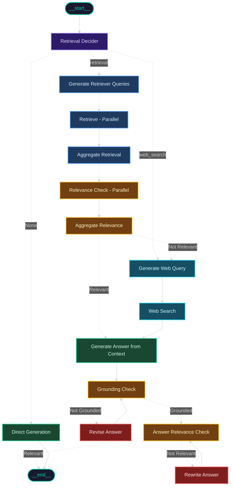

<p align="center">
  
  
  
  
  
</p>

<h1 align="center">Self-RAG & Corrective RAG for the Indian Constitution & IPC</h1>

<p align="center">
  <em>An agentic, self-correcting Retrieval-Augmented Generation system that delivers reliable, grounded answers on Indian law — powered by LangGraph, DeepSeek R1/V3, and multi-stage validation.</em>
</p>

---

## Overview

This project implements an advanced **Self-RAG** and **Corrective RAG (CRAG)** pipeline using **LangGraph** to provide question-answering over the **Constitution of India** and the **Indian Penal Code (IPC)**.

Unlike vanilla RAG, this system **self-evaluates and self-corrects** at every stage:

- **Routes intelligently** — decides between vector retrieval, web search, or direct generation per query.
- **Validates retrieved context** — filters irrelevant chunks via parallel Map-Reduce relevance scoring.
- **Checks grounding** — verifies the generated answer is supported by evidence.
- **Self-corrects** — rewrites or revises answers that fail grounding or relevance checks.
- **Falls back to web search** — automatically searches the web when local retrieval fails.

---

## Evaluation

[Ragas](https://docs.ragas.io/) is used end-to-end — not just for scoring, but for building the evaluation dataset itself.

### Evaluation Methodology

1. **Knowledge Graph Construction** — A knowledge graph is first built from the document corpus (Constitution articles & IPC sections) using Ragas's `KnowledgeGraph` API, capturing entity and relationship structure across the legal texts. ([`knowledge_graph.py`](src/evaluation/knowledge_graph.py))

2. **K-Means Clustering for Diverse Sampling** — To ensure the test set covers the full breadth of the corpus, all document chunks are embedded using `all-mpnet-base-v2`, then K-means clustering is run (sweeping k=4–24, selecting optimal k via silhouette score). Stratified sampling from each cluster produces a representative subset of 100 documents. ([`clustering.py`](src/evaluation/clustering.py))

3. **Synthetic Test Set Generation** — Using Ragas's `TestsetGenerator` with the knowledge graph and the sampled documents, diverse evaluation queries (single-hop, multi-hop, etc.) are generated along with reference answers and reference contexts — no manual question authoring required. ([`test_set_generation.py`](src/evaluation/test_set_generation.py))

4. **End-to-End Evaluation** — Each test query is run through the full LangGraph pipeline, and the generated answer + retrieved contexts are scored by Ragas across four metrics. Results are versioned, resumable, and saved with full per-query metadata. ([`evaluate.py`](src/evaluation/evaluate.py))

### Metrics

| Metric | What it measures |
|---|---|
| **Faithfulness** | Is the answer factually consistent with the retrieved context? |
| **Answer Relevancy** | Does the answer address the user's question? |
| **Context Precision** | Are the retrieved documents relevant to the question? (Non-LLM, reference-based) |
| **Context Recall** | Were all necessary reference documents retrieved? |

### Results

| Metric | Score |
|---|---|
| **Faithfulness** | 0.96 |
| **Answer Relevancy** | 0.75 |
| **Context Precision** (Non-LLM, reference-based) | 0.95 |
| **Context Recall** | 0.90 |

### Running the Evaluation

```bash
python src/evaluation/evaluate.py
```

> Results are versioned and saved to `data/evaluation_progress_results/`. The pipeline supports **resumable runs** — if interrupted, it picks up where it left off.

<details>
<summary><strong>Why <code>context_precision</code> uses a non-LLM variant</strong></summary>

Ragas's LLM-based `context_precision` evaluates each chunk independently against the full generated answer. For multi-hop questions (e.g., synthesizing two Constitution articles), this produces false negatives — neither article alone supports the combined answer, yielding a score of 0 despite perfect retrieval. `NonLLMContextPrecisionWithReference` is used instead, which compares against reference contexts directly. This is a [documented limitation](https://github.com/explodinggradients/ragas/issues/308) of the original metric.

</details>

<details>
<summary><strong>A note on the <code>answer_relevancy</code> score</strong></summary>

Answer relevancy scores can appear artificially low on compound, multi-part questions due to a known limitation in Ragas's `ResponseRelevancy` metric: it generates 3 hypothetical questions from the answer (by default) and averages their similarity to the original question, but does not guarantee these generated questions are actually diverse — it simply re-runs the same prompt multiple times and relies on sampling randomness for variation. This is a well-known, previously reported issue, documented in [GitHub Issue #1979](https://github.com/explodinggradients/ragas/issues/1979) ("ResponseRelevancy does not guarantee varied questions, making strictness effectively pointless") and [GitHub Issue #1192](https://github.com/explodinggradients/ragas/issues/1192) ("Answer Relevancy giving same questions everytime"), and is compounded by a separate reported bug where the evaluator LLM's temperature setting is sometimes ignored, further reducing output diversity ([GitHub Issue #1812](https://github.com/explodinggradients/ragas/issues/1812)). In this evaluation, this caused all 3 generated questions for all the test queries to be identical, capturing only one clause of the original multi-part question and understating the true relevancy score.

</details>

---

## Key Features

| Feature | Description |
|---|---|
| **Intelligent Query Routing** | DeepSeek R1 chain-of-thought reasoning classifies queries into `retrieval`, `web_search`, or `direct_generation` paths |
| **Parallel Multi-Query Retrieval** | Generates optimized sub-queries and fans out parallel vector searches via LangGraph's `Send` API |
| **Parallel Relevance Filtering** | Map-Reduce pattern scores each retrieved chunk independently, then aggregates to filter noise |
| **Web Search Fallback** | Tavily Search API provides real-time web context when local retrieval finds no relevant results |
| **Hallucination Guard** | Grounding checker verifies every answer against source evidence; ungrounded answers are revised by a critic model |
| **Answer Relevance Loop** | A judge model evaluates if the final answer actually addresses the user's query; irrelevant answers are rewritten |
| **Conversational Memory** | SQLite-backed state checkpointing preserves chat history across sessions |
| **Observability** | Arize Phoenix integration provides full tracing of every LLM call, retrieval, and decision |
| **Automated Evaluation** | End-to-end Ragas evaluation pipeline with faithfulness, answer relevancy, context precision, and context recall |

---

## Workflow Architecture

The LangGraph state machine orchestrating the entire pipeline:




**Legend**

| Colour | Stage |
|---|---|
| Purple | Query Routing |
| Blue | Vector Retrieval |
| Green | Answer Generation |
| Yellow | Validation & Checks |
| Red | Self-Correction |
| Cyan | Web Search Fallback |

---

## Demo

<p align="center">
  
  <br />
</p>

---

## Tech Stack

| Layer | Technology |
|---|---|
| **Orchestration** | [LangGraph](https://github.com/langchain-ai/langgraph) — agentic state machine with parallel fan-out |
| **LLMs** | [DeepSeek R1](https://deepseek.com/) (reasoning) & [DeepSeek V3](https://deepseek.com/) (generation) via AWS Bedrock |
| **Embeddings** | [sentence-transformers/all-mpnet-base-v2](https://huggingface.co/sentence-transformers/all-mpnet-base-v2) |
| **Vector Store** | [ChromaDB](https://www.trychroma.com/) — persistent local vector database |
| **Web Search** | [Tavily Search API](https://tavily.com/) — real-time web search fallback |
| **Observability** | [Arize Phoenix](https://phoenix.arize.com/) — LLM tracing & monitoring |
| **Evaluation** | [Ragas](https://docs.ragas.io/) — faithfulness, relevancy, context recall & precision |
| **CLI** | [Rich](https://github.com/Textualize/rich) — beautiful terminal interface with streaming |
| **Package Manager** | [uv](https://github.com/astral-sh/uv) — fast Python package management |

---

## Project Structure

```
constitution_rag/
├── src/
│   ├── cli.py                          # Interactive terminal interface (Rich-based)
│   ├── create_vector_store.py          # Data ingestion → ChromaDB
│   ├── workflow/
│   │   ├── __init__.py                 # Graph construction & compilation
│   │   ├── state.py                    # TypedDict state schema with reducers
│   │   ├── nodes.py                    # All node implementations (13 nodes)
│   │   ├── edges.py                    # Conditional edge routing logic
│   │   ├── config.py                   # LLM clients, vector store, search tools
│   │   ├── prompts.py                  # System prompts for every node
│   │   └── schemas.py                  # Pydantic schemas for structured output
│   └── evaluation/
│       ├── evaluate.py                 # End-to-end Ragas evaluation pipeline
│       ├── test_set_generation.py      # Synthetic test set generator
│       ├── clustering.py               # K-means clustering for test diversity
│       └── knowledge_graph.py          # Knowledge graph construction
├── data/
│   ├── articles.json                   # Constitution of India articles
│   ├── penal_code_sections.json        # IPC sections
│   ├── constitution_and_ipc.chroma/    # Persisted ChromaDB vector store
│   └── test_set.csv                    # Evaluation test set
├── notebooks/
│   ├── data_collector.ipynb            # Web scraping & data preparation
│   ├── srag.ipynb                      # Self-RAG prototyping & experiments
│   ├── ragas.ipynb                     # Ragas evaluation experiments
│   └── ragas_results.ipynb             # Evaluation results analysis
├── pyproject.toml                      # Project config & dependencies
├── .env                                # API keys (not committed)
└── README.md
```

---

## Getting Started

### Prerequisites

- **Python 3.12+**
- [uv](https://github.com/astral-sh/uv) (recommended) or pip
- API keys for: **AWS Bedrock** (DeepSeek models), **Tavily Search**, **LangSmith** (optional)

### 1. Clone the Repository

```bash
git clone https://github.com/pankaj-2708/Self-RAG-on-Indian-Constitution.git
cd Self-RAG-on-Indian-Constitution
```

### 2. Install Dependencies

```bash
uv sync
```

<details>
<summary>Alternative: using pip</summary>

```bash
pip install -e .
```
</details>

### 3. Configure Environment Variables

Create a `.env` file in the project root:

```env
# AWS Bedrock (required)
AWS_BEARER_TOKEN_BEDROCK="your-aws-bearer-token"

# Web Search (required for fallback)
TAVILY_API_KEY="your-tavily-api-key"

# Observability (optional)
LANGSMITH_TRACING_V2="true"
LANGSMITH_ENDPOINT="https://api.smith.langchain.com"
LANGSMITH_API_KEY="your-langsmith-api-key"
LANGSMITH_PROJECT="constitution"
```

### 4. Build the Vector Store

```bash
python src/create_vector_store.py
```

> This parses `data/articles.json` and `data/penal_code_sections.json` and persists embeddings into `data/constitution_and_ipc.chroma/`.

### 5. Launch the CLI

```bash
python src/cli.py
```

| Command | Action |
|---|---|
| `/new` | Start a new conversation thread |
| `exit` | Quit the CLI |

---

---

## How It Works

1. **Query Routing** — DeepSeek R1 classifies the user's question as requiring `retrieval` (vector DB), `web_search`, or `direct_generation`.

2. **Multi-Query Generation** — For retrieval queries, the system generates up to 3 optimized sub-queries with optional metadata filters (Article/Section numbers).

3. **Parallel Retrieval** — Each sub-query triggers a parallel vector search via LangGraph's `Send` API (fan-out pattern).

4. **Parallel Relevance Scoring** — Every retrieved chunk is independently scored for relevance to the query (Map step), then results are aggregated (Reduce step). Irrelevant chunks are discarded.

5. **Web Search Fallback** — If no relevant context survives filtering, the system automatically generates web search queries and fetches results from Tavily.

6. **Answer Generation** — DeepSeek R1 synthesizes an answer from the validated context, leveraging chain-of-thought reasoning.

7. **Grounding Verification** — A grounding model checks if the answer is supported by the source evidence. Ungrounded answers are revised by a critic model.

8. **Relevance Validation** — A judge model assesses whether the answer actually addresses the user's question. Irrelevant answers are rewritten with explicit reference to the relevance gap.

9. **Response Delivery** — The validated, grounded, relevant answer is returned to the user.

---

## Data

The legal corpus used in this project was parsed and structured from official Indian government websites:

| File | Source | Description |
|---|---|---|
| `data/articles.json` | [Legislative Department, Ministry of Law and Justice](https://legislative.gov.in/constitution-of-india/) | All articles of the Constitution of India |
| `data/penal_code_sections.json` | [India Code](https://www.indiacode.nic.in/) | Sections of the Indian Penal Code (IPC) |

The raw data was scraped, cleaned, and structured into JSON format via the [`data_collector.ipynb`](notebooks/data_collector.ipynb) notebook.

---

## Acknowledgements

- [LangChain](https://github.com/langchain-ai/langchain) & [LangGraph](https://github.com/langchain-ai/langgraph) for the agentic orchestration framework
- [DeepSeek](https://deepseek.com/) for the R1 reasoning and V3 generation models
- [Ragas](https://docs.ragas.io/) for the evaluation framework
- [Arize Phoenix](https://phoenix.arize.com/) for observability tooling

---

<p align="center">
  <sub>Built with care for advancing legal AI in India</sub>
</p>
